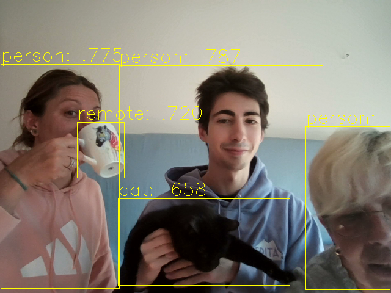

# Simple Webcam Object Detection (C++ & OpenCV) 🚀

A straightforward C++ project demonstrating real-time object detection on a webcam stream using **OpenCV's DNN module** and a pre-trained **YOLOv5s** model.

## 📂 Project Structure

```bash
simple_cv_project/
├── build.sh                 # Convenient script to configure and build the project
├── CMakeLists.txt           # CMake build configuration file
├── images/
│   └── demo.png             # Example output
├── LICENSE                  # Licensing information
├── main.cpp                 # Main application code (Webcam capture, DNN inference, post-processing)
├── README.md                # This file
└── yolo/
    ├── coco-classes.txt     # List of the 80 COCO object classes (for labeling detections)
    └── yolov5s.onnx         # The ONNX-exported YOLOv5s model weights
```

## 🛠️ Prerequisites

- **OpenCV 4.x or later**
- **CMake 3.10 or later**
- **A C++ compiler (GCC, Clang, MSVC)**

## ⚙️ Build and Run Instructions

This project uses CMake for building. The `build.sh` script provides the simplest way to get started on Unix-like systems.

### 1. Clone the Repository

```bash
git clone https://github.com/Sodachi0/simple_cv_project.git
cd simple_cv_project
```

### 2. Build and run the Project

Execute the provided build script. This will create a `build/` directory, configure CMake, compile the source code, and place the executable in the `build/` folder. The executable will then automatically look for the model files in the `yolo/` directory and attempt to open your default webcam.

```bash
./build.sh
cd build
./app
```

## 🧠 Model Details

| Detail     | Value                                                             |
|------------|-------------------------------------------------------------------|
| Model      | yolov5s.onnx                                                      |
| Input Size | 640 x 640                                                         |
| Classes    | 80 classes from the COCO dataset (e.g., person, car, dog, etc...) |
| Backend    | OpenCV DNN Module (cv::dnn::Net)                                  |

## 🖼️ Example Output


